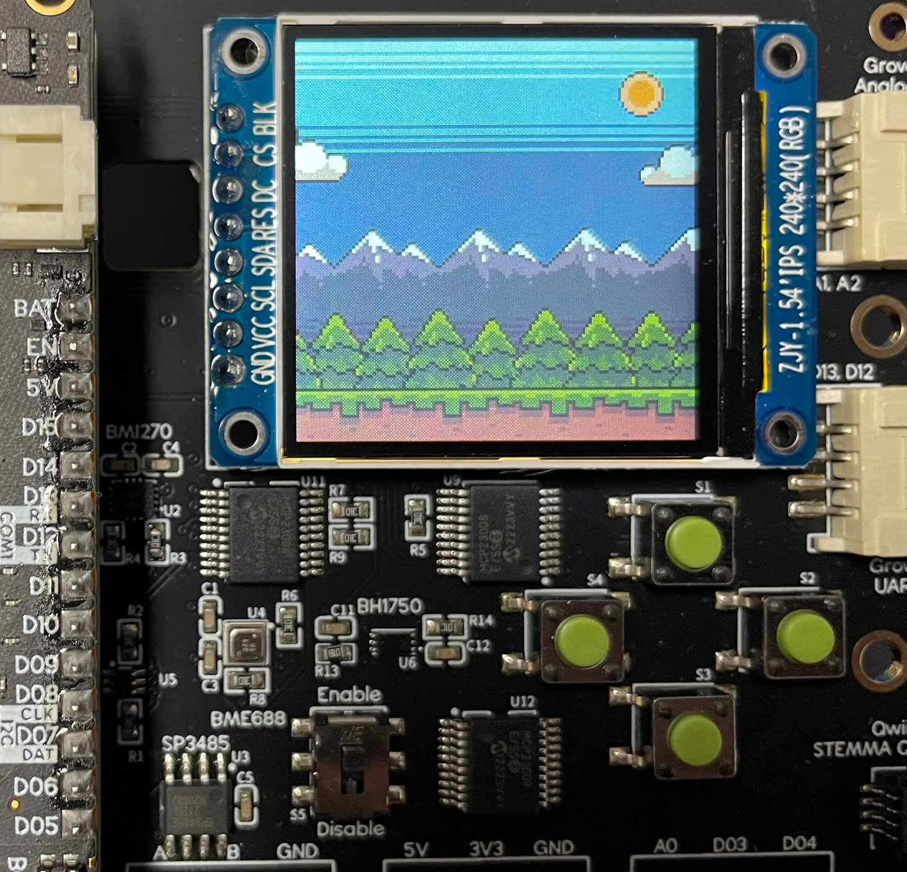
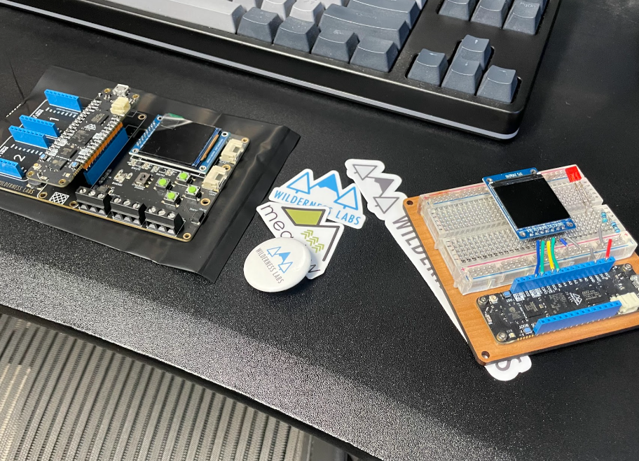

# Glade2d

Glade2d is a 2D rendering/game engine intended to run on a [Wilderness Labs Meadow Board](https://www.wildernesslabs.co/). Glade attempts to provide an API for composing complex screens made up of multiple sprites. It provides a game loop and can update and render as fast as possible, as is common in game-like applications, or it can render on demand. Rendering on demand allows the developer to redraw the scene in reaction to some input (sensor value, button press, etc) for much lower power consumption.

Glade can run on the Meadow with a custom display device, on the Project Lab board, or on the Juego board. It also has an implementation that uses MonoGame for rendering, allowing developers to rapidly prototype with full debugging capabilities before deploying and testing on actual hardware,

A "glade" is an open space in the forest, aka a Meadow, which is what Glade2d was designed to run on!

## Getting Started

Currently, Glade2d early in development and does not have official releases or packages. To experiment with Glade2d:

1. Clone the repository and open the Glade2d.sln in Visual Studio
1. If you have a Meadow installed on a ProjectLab board v2.e or better, run one of the test projects that targets the Project Lab.
1. If you have a custom configuration, initialize your display and inputs and run one of the shared sample projects.
1. If you have no hardware, test out the MonoGame sample, which can run on your desktop

The sample game, Glade Invade, is a simple Space Invaders like game that demonstrates many of the capabilities and best practices for using Glade!

## Documentation

See the [docs index page in this repo](/docs/index.md) to get started.

## Contributing

File an issue, write a doc, submit a PR, or reach out to [@profexorgeek](https://twitter.com/profexorgeek) on Twitter.

## Roadmap

The roadmap/backlog has now moved to a [Trello board](https://trello.com/b/YuEifteL/glade2d)!

